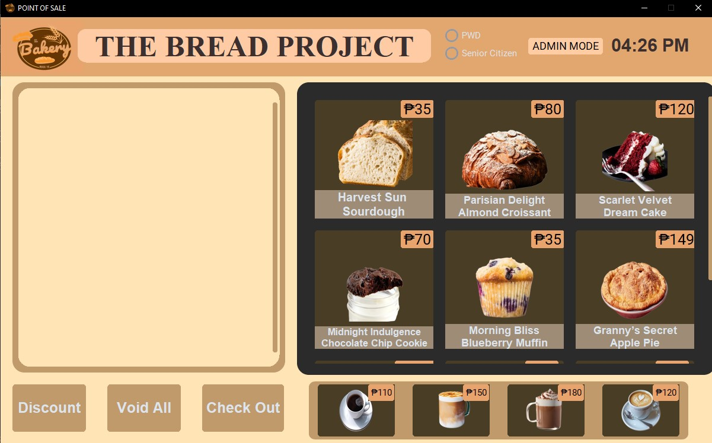
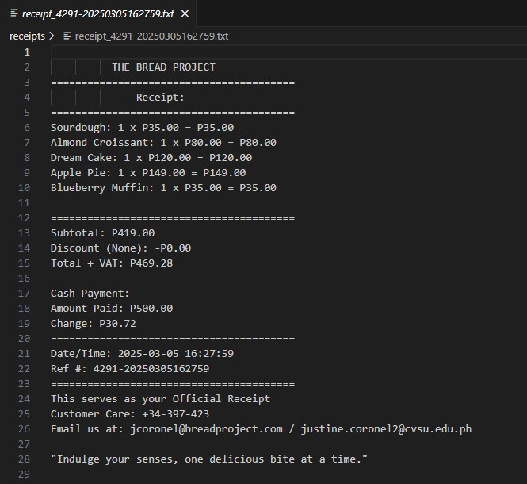

# POS-System

THE BREAD PROJECT🍞🛒
A Python-based Point of Sale (POS) system with a modern GUI built using CustomTkinter. This system allows users to process transactions, generate receipts, apply discounts, and track purchase history.

##📌 Features
✅ User Authentication – Login system for crew and admin access  
✅ Product Selection – Clickable UI to add items to the receipt  
✅ Transaction Processing – Calculates total cost, VAT, and discounts  
✅ Receipt Generation – Saves receipts as TXT and PDF files  
✅ Discounts – Supports PWD & Senior Citizen discounts  
✅ Transaction History – View past transactions with receipt details  

## 🛠️ Technologies Used
Python  
CustomTkinter – for modern GUI  
Pillow – for handling images  
ReportLab & FPDF – for generating PDF receipts   
OS & Datetime – for file handling and timestamps

---------------------------------------------------------------------------------------------------------------------------------------------------
## 🚀 Installation & Setup
Clone the repository:  
git clone https://github.com/zenn0001/POS-System.git  
cd POS-System

Install dependencies: (DO THIS ON TERMINAL)  
> pip install customtkinter pillow reportlab fpdf2

Run the application:  
python main.py

----------------------------------------------------------------------------------------------------------------------------------------------------

## ----- FOR LOG IN FUNCTION ----- 
### 🔑 Login Credentials  
**Admin:**  
Username: admin  
Password: admin  

**Crew:**  
Username: coronel  
Password: coronel

-----------------------------------------------------------------------------------------------------------------------------------------------------
## 📸 Screenshots

### Login Page

### Point of Sale Interface

### Point of Sale Interface / CHECKOUT 

### Receipt

